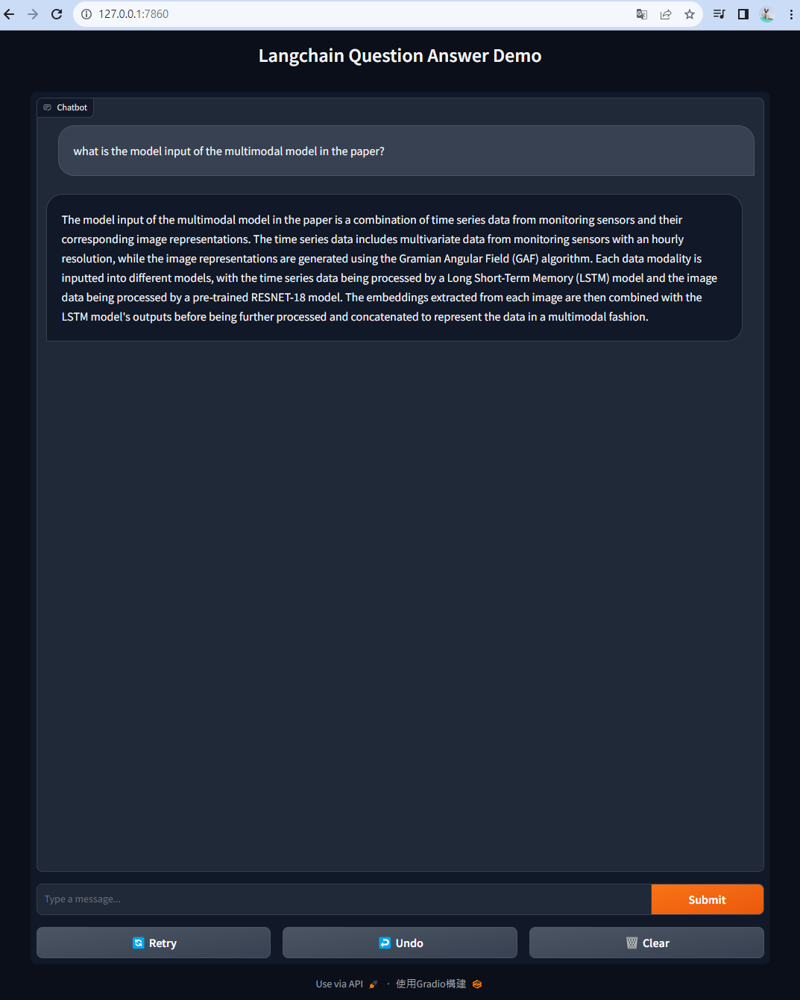

# langchain-qa-demo

## Setup

- Setup virtual env

```bash
python -m venv .venv

# For Windows Powershell
.\.venv\Scripts\Activate.ps1

pip install -r requirements.txt
```

- Store any `.docx`, `.pdf` and `.txt` files in "docs" folder for querying.

## Run the program

```bash
# cli mode
python app.py

# web-ui
python app.py -m web
# Go to http://127.0.0.1:7860

```

- Cli

```text
---------------------------------------------------------------------------------
Langchain Question Answer Demo. You are now ready to start interacting with your documents
---------------------------------------------------------------------------------
Prompt: what is the model input of the multimodal model in the paper?
Answer: The model input of the multimodal model in the paper is a combination of time series data from monitoring sensors and image data generated using the Gramian Angular Field (GAF) algorithm. The time series data represents the operating conditions of the equipment, such as temperature, pressure, and flow rates. The GAF algorithm is used to transform the time series data into image representations. These two modalities, time series data and image data, are inputted into different models within the multimodal architecture. The time series data is processed by a Long Short-Term Memory (LSTM) model, while the image data undergoes a pre-trained RESNET-18 model. The embeddings extracted from each image are then combined with the outputs from the LSTM model, resulting in a multimodal representation of the data.
Prompt: q
Exiting
```

- Web


